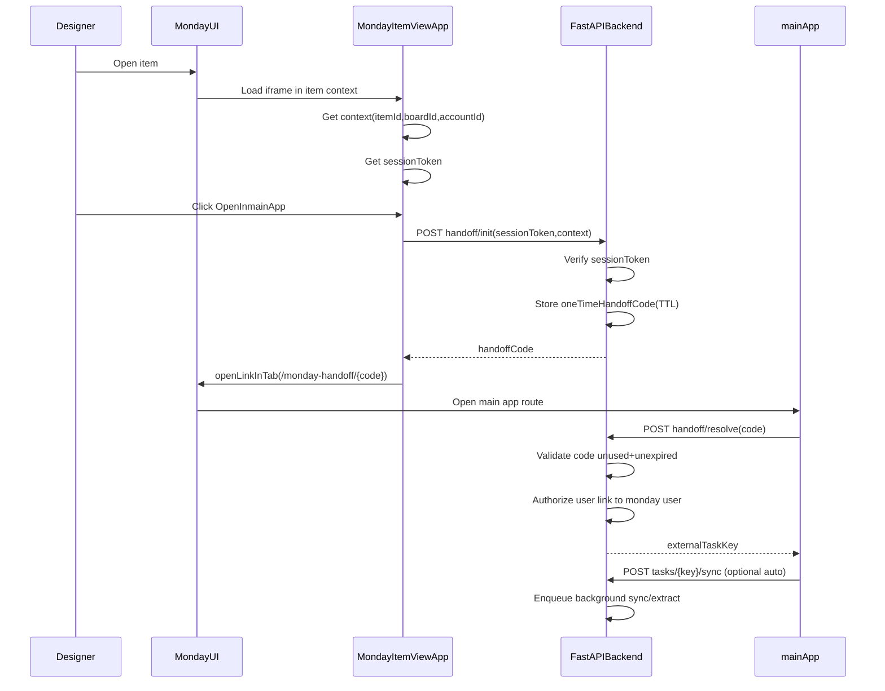

# Monday-to-main-App Assistant (FastAPI + Supabase Storage + pgvector)

## Goals

- **Capture the active monday item** from inside monday (Item View) and **handoff securely** to your main app.
- **Sync and cache** monday item columns + email/attachments + CSV outputs into Supabase.
- **Answer task-scoped questions** using Gemini-3.5-flash via a LangChain tool-calling agent, grounded by **pgvector retrieval**.
- **Lifecycle**: delete **raw binaries** (emails, PDFs, images, CSVs) **30 days after Done**, while **retaining derived** `TaskContext` + text chunks + embeddings.

## Architecture (high-level)




```mermaid
flowchart TD
  Monday[MondayGraphQL] --> Sync[TaskSyncer]
  Sync --> Storage[SupabaseStoragePrivateBucket]
  Sync --> Context[TaskContextJSON(Postgres)]
  Sync --> Chunker[ChunkAndEmbed]
  Chunker --> Chunks[TaskChunks+pgvector]
  mainUI[mainAppUI] --> Chat[ChatEndpoint]
  Chat --> Context
  Chat -->|pgvector topK| Chunks
  Chat --> Gemini[Gemini35Flash]
```


## Repo layout to create

- **Backend**
  - `[backend/app/main.py](backend/app/main.py)`: FastAPI app + startup scheduler
  - `[backend/app/config.py](backend/app/config.py)`: env config
  - `[backend/app/auth/](backend/app/auth/)`: main-app auth integration + monday OAuth callbacks
  - `[backend/app/monday/](backend/app/monday/)`: monday SDK, sessionToken verification, GraphQL client
  - `[backend/app/handoff/](backend/app/handoff/)`: one-time code init/resolve
  - `[backend/app/tasks/](backend/app/tasks/)`: sync/extraction, file registry, status/done handling
  - `[backend/app/retrieval/](backend/app/retrieval/)`: chunking, embeddings, pgvector queries
  - `[backend/app/llm/](backend/app/llm/)`: LangChain agent + tools
  - `[backend/app/scheduler/](backend/app/scheduler/)`: daily purge + (optional) periodic resync
  - `[backend/migrations/](backend/migrations/)`: Alembic migrations
- **Monday Item View launcher** (small React app)
  - `[monday_item_view/src/](monday_item_view/src/)`: button UI + calls handoff/init
  - Hosted at a public HTTPS URL (Vercel/Netlify/etc.) and configured in monday app.

> The main app UI is assumed to exist; you will add routes `/monday-handoff/:code` and `/tasks/:externalTaskKey` to call the backend.

## Step-by-step build plan

### Step 0 — Foundations (monday + Supabase)

- **monday**
  - Create monday app with **Item View** feature.
  - Enable **OAuth** (per-user) and record:
    - `MONDAY_CLIENT_ID`, `MONDAY_CLIENT_SECRET`
    - `MONDAY_SIGNING_SECRET` (for `sessionToken` verification)
- **Supabase**
  - Create project and private Storage bucket `raw-monday`.
  - Enable pgvector (`create extension vector;`).
  - Create DB tables + indexes via migrations.

### Step 1 — Monday Item View launcher (selected item capture)

- Implement Item View app to:
  - `monday.get('context')` and `monday.get('sessionToken')`
  - `POST /api/monday/handoff/init` to your backend
  - Open main app via `monday.execute('openLinkInTab', { url })`

### Step 2 — Handoff resolve in main app

- main route `/monday-handoff/:code`:
  - calls `POST /api/monday/handoff/resolve`
  - receives `externalTaskKey` and redirects to `/tasks/:externalTaskKey`
- frontend stack for the main app: use React/Typescript with Tailwind + shadcn/ui for CSS

### Step 3 — Authorization (per-user OAuth + linkage)

- Add “Connect monday” to main app:
  - backend endpoints `GET /auth/monday/login` and `GET /auth/monday/callback`
  - store access token mapped to main user
- On `handoff/resolve`:
  - require main app user session
  - require linkage between main app user and `mondayUserId` from verified `sessionToken`
  - perform a cheap “can-read item” check using that user’s monday token

### Step 4 — FastAPI endpoints and contracts

- Implement:
  - `POST /api/monday/handoff/init`
  - `POST /api/monday/handoff/resolve`
  - `POST /api/tasks/{externalTaskKey}/sync`
  - `GET /api/tasks/{externalTaskKey}/summary`
  - `GET /api/tasks/{externalTaskKey}/sources`
  - `GET /api/tasks/{externalTaskKey}/files/{fileId}/signed-url`
  - `POST /api/chat` (SSE recommended)

### Step 5 — Supabase Postgres schema (pgvector)

- Create tables (via Alembic) aligned to:
  - `tasks`
  - `task_snapshots`
  - `task_files`
  - `task_chunks`
  - `user_monday_links`
  - `handoff_codes` (or store these in Redis later; for “simple” use Postgres with TTL columns)
- Embedding dimensionality decision:
  - Use `vector(1536)` to stay within pgvector HNSW/IVFFlat limits (<= 2000 dims).
  - Generate embeddings with `output_dimensionality=1536` and normalize for cosine similarity.
- Update schema + ORM to match 1536 dims:
  - `backend/migrations/versions/0002_create_task_tables.py` -> `Vector(1536)`
  - `backend/app/models.py` -> `Vector(1536)`
- Migration for existing DBs (no data yet):
  - `0003_add_task_chunks_embedding_index` drops/recreates `embedding` as `vector(1536)` and adds HNSW index.
  - Keep Alembic revision IDs <= 32 characters or widen `alembic_version.version_num` to avoid truncation errors.

### Step 6 — Supabase Storage for raw binaries

- Use a **private** bucket `raw-monday`.
- Object key convention:
  - `monday/{accountId}/{boardId}/{itemId}/{snapshotVersion}/{assetId}/{filename}`
- Ingestion rules:
  - download monday asset immediately
  - compute `sha256`
  - upload to Storage
  - upsert `task_files` row with bucket/path/hash/metadata

### Step 7 — Sync + extraction pipeline

- Trigger: right after resolve (auto) and via `POST /sync`.
- Pipeline:
  - Fetch monday item columns + relevant file assets (email + CSV).
  - Compute `snapshotVersion` (e.g., monday item `updated_at` plus asset IDs or a hash).
  - If unchanged, short-circuit.
  - Persist raw email/CSV to Storage.
  - Parse CSV into structured parameters.
  - Parse `.eml`/`.msg` to extract attachments; persist attachments to Storage.
  - Extract text from PDFs and OCR images as needed.
  - Chunk + embed and insert into `task_chunks`.
  - Embeddings (1536 schema alignment):
    - Generate with Gemini `output_dimensionality=1536`.
    - Normalize vectors before storage (Gemini 1536/768 outputs are not normalized).

IMPORTANT -Please refer to specifics in: [https://ai.google.dev/gemini-api/docs/embeddings](https://ai.google.dev/gemini-api/docs/embeddings)

```
- Normalization snippet (L2):
  - `v = v / ||v||` (norm should be ~1.0)
- Store `task_chunks.chunk_text`, `task_chunks.embedding`, and optional `page`/`section`.
```

- Ensure chunk linkage and idempotency:
  - `task_chunks.file_id` points to `task_files.id` for the same snapshot.
  - Scope to the latest snapshot for the task.
  - Clear/replace prior chunks for the snapshot to keep sync idempotent.

### Step 8 — Retrieval + LLM (LangChain + Gemini)

- Implement tools:
  - `get_task_context(externalTaskKey)`
  - `search_task_docs(externalTaskKey, query)` (pgvector topK)
- Chat flow:
  - load structured params from `task_snapshots.task_context_json`
  - retrieve topK chunks via pgvector (cosine distance)
    - Generate query embeddings with the same `output_dimensionality=1536`
    - Normalize query vectors to match storage (same L2 norm)
    - SQL shape: `ORDER BY embedding <=> :query_embedding LIMIT :k`
    - Filter by task scope (join `task_files` + latest snapshot)
    - Return citations (filename + page/section + snippet)
  - call Gemini tool-calling agent; return answer with citations

### Step 9 — main app UI integration

- `/tasks/:externalTaskKey` view:
  - Summary panel (validated columns + CSV params)
  - Sources panel (list files, signed URLs)
  - Chat panel (streamed answers, show citations)

### Step 10 — Lifecycle: delete raw files 30 days after Done (keep derived)

- Define Done signal: a monday Status label (e.g. `Done`).
- On each sync:
  - detect transition to Done → set `tasks.done_at=now()`, `tasks.delete_raw_after=done_at+30d`
  - detect reopen → clear `done_at/delete_raw_after`
- Daily purge job:
  - select tasks where `delete_raw_after <= now()` and `raw_purged_at is null`
  - delete Storage objects referenced by `task_files` (where `deleted_at is null`)
  - mark `task_files.deleted_at`
  - when complete, set `tasks.raw_purged_at=now()`

### Step 11 — “Simple in-app background jobs” implementation

- Use FastAPI-triggered background work for sync/extraction:
  - enqueue work on request using an internal queue abstraction backed by `asyncio.create_task` + `asyncio.to_thread` for CPU-bound parsing.
- Use an in-app scheduler for purge:
  - APScheduler `AsyncIOScheduler` started on app startup.
  - Guard against duplicate schedulers by:
    - running a single API instance in production **or**
    - acquiring a Postgres advisory lock at job start so only one instance purges.
- Document the upgrade path to Celery/RQ + Redis once throughput grows.

## Key implementation details (to bake into the build)

- **sessionToken verification**: verify JWT signature and issuer using `MONDAY_SIGNING_SECRET` before trusting `itemId`.
- **No reusable tokens in URLs**: only pass `handoffCode`.
- **Storage security**: bucket private; only backend issues short-lived signed URLs.
- **Idempotency**: sync and purge should be safe to rerun.
- **Observability**: store per-task sync status, last error, and purge outcomes.

## MVP milestones

- MVP1: Item View launcher → handoff → main route → backend resolves `externalTaskKey`.
- MVP2: Sync pulls columns + CSV + stores TaskContext JSON.
- MVP3: Email/attachments ingestion to Storage + chunking + pgvector search.
- MVP4: Chat endpoint with retrieval + citations.
- MVP5: Done→30d purge of raw binaries.

